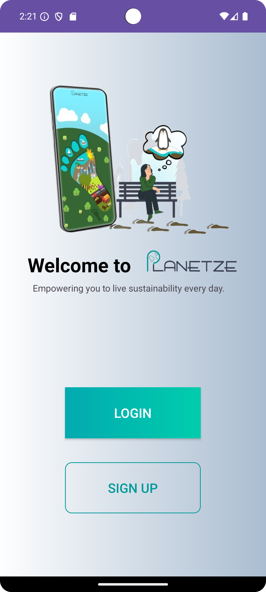
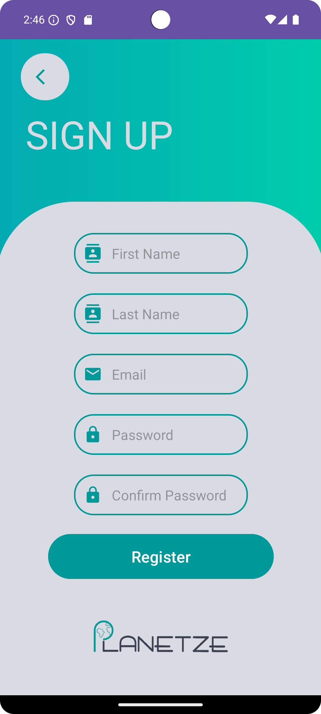
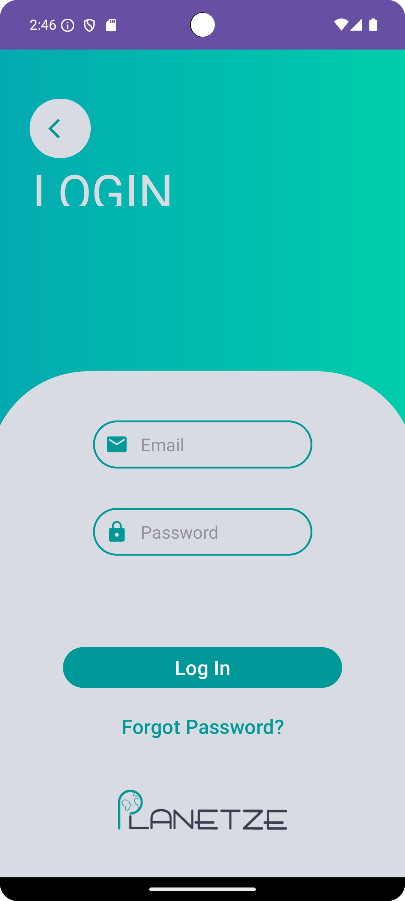
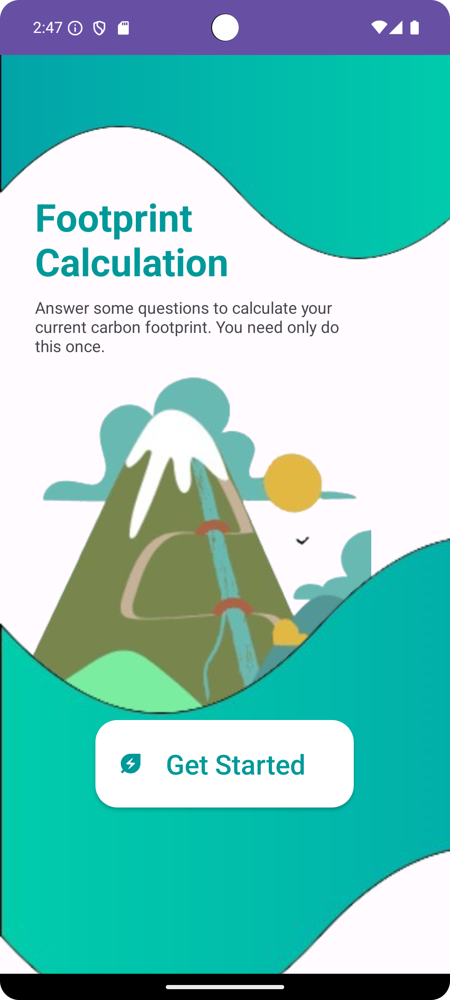
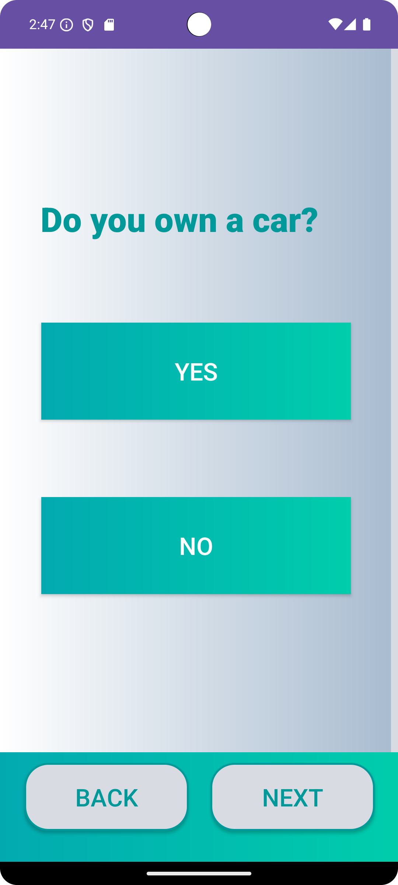

# Planetze Carbon Footprint App

By: Chase, Fred, Gabriel, Isaac, Shawn, Zacky
Installation, for this repo, after cloning; build the app, open on emulator of choice, and run the app module.

## App Flow

Navigation (using images) only. For a more comprehensive description of each feature, scroll down to General/Generic Itemization

###### Start of App

<table>
  <tr>
    <td style="text-align: center;">
      
      
Homepage

    </td>
    <td style="text-align: center;">
      
      
Sign Up

    </td>
    <td style="text-align: center;">
      
      
Login

    </td>
  </tr>
</table>
<!-- 

    

        
        
Homepage

    

    

        
        
Sign Up

    

    

        
        
Login

    

 -->

###### First time user experience
<table style="display: flex; justify-content: center; align-items: center;">
  <tr>
    <td style="text-align: center;">
      
      
Survey Landing

    </td>
    <td style="text-align: center;">
      
        
Survey Question

    </td>
  </tr>
</table>
<!-- 

    

        
        
Survey Landing

    

    

        
        
Survey Question

    

 -->

## General/Generic Itemization

### Overview

Planetze is a comprehensive sustainability platform designed to help individuals and employees monitor, reduce, and offset their carbon footprints. It empowers users to adopt eco-friendly habits, track daily emissions, and contribute to certified carbon offset projects, making climate action simple, accessible, and impactful.

---

### Features

#### 1. **Eco Tracker**

-   Tracks users' carbon emissions based on daily activities.
-   Allows manual input of transportation, energy use, food, and consumption data.
-   Provides real-time CO2e emission calculations for logged activities.

#### 2. **Eco Gauge**

-   Visual representation of user progress in reducing carbon emissions.
-   Displays emissions breakdown by category (e.g., transportation, energy, food).
-   Offers trend analysis and comparison with global/national averages.

#### 3. **Eco Balance**

-   Enables users to offset their carbon footprint by supporting certified offset projects.
-   Features a seamless flow to explore, select, and purchase offsets.

---

### Usage

#### **Step 1: Onboarding**

-   First-time users answer lifestyle questions to calculate their annual carbon footprint.

#### **Step 2: Daily Tracking**

-   Log daily activities in the Eco Tracker for real-time emissions tracking.

#### **Step 3: Monitor Progress**

-   Use the Eco Gauge to visualize emissions trends and compare with benchmarks.

---

### User Flows

#### **Registration & Login**

1. Sign up with full name, email, and password.
2. Verify your email to activate the account.
3. Log in to access the dashboard.

#### **Activity Logging**

-   Transportation: Enter vehicle type, distance, or time spent on public transport.
-   Food: Log meal types and frequency of consumption.
-   Energy: Update monthly bills and energy source details.
-   Shopping: Track purchases like clothing or electronics.

#### **Habit Suggestions**

-   Browse or receive recommendations for eco-friendly habits.
-   Track and monitor progress towards new sustainable behaviors.

---

### Key Visuals

1. **Eco Gauge Dashboard:** Intuitive charts to track emissions.
2. **Activity Input Forms:** Simple and user-friendly data entry interfaces.
3. **Carbon Offset Marketplace:** Interactive project browsing and selection.

---

**About Us** 🌍
Visit: https://planetze.io/
